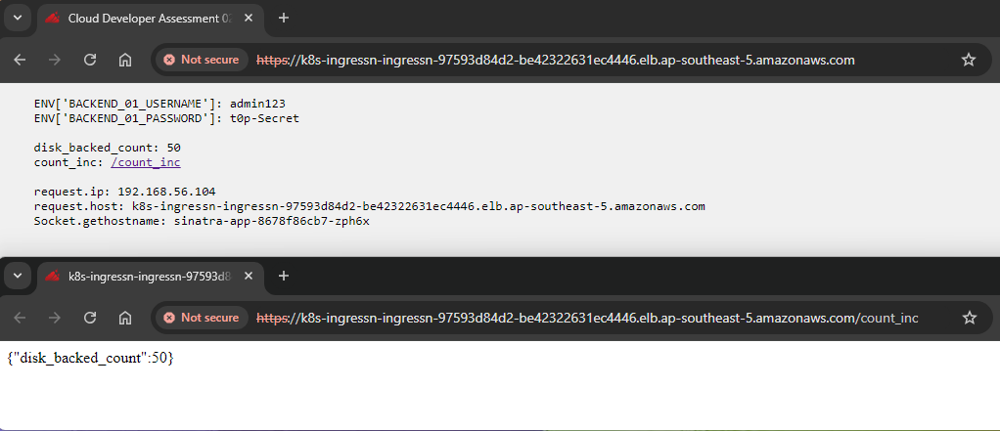
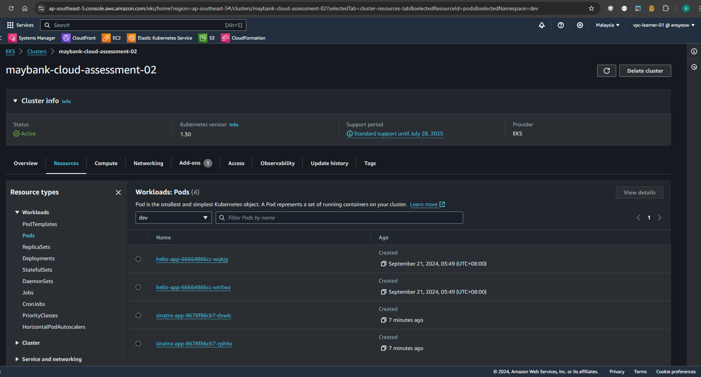

| Desc  | Screenshot                      |
| ----- | ------------------------------- |
| Web   |            |
| Pods  |  |

```
echo configmaps endpoints limitranges persistentvolumeclaims pods podtemplates replicationcontrollers resourcequotas secrets serviceaccounts services challenges.acme.cert-manager.io orders.acme.cert-manager.io controllerrevisions.apps daemonsets.apps deployments.apps replicasets.apps statefulsets.apps horizontalpodautoscalers.autoscaling cronjobs.batch jobs.batch certificaterequests.cert-manager.io certificates.cert-manager.io issuers.cert-manager.io leases.coordination.k8s.io endpointslices.discovery.k8s.io targetgroupbindings.elbv2.k8s.aws policyendpoints.networking.k8s.aws ingresses.networking.k8s.io networkpolicies.networking.k8s.io poddisruptionbudgets.policy rolebindings.rbac.authorization.k8s.io roles.rbac.authorization.k8s.io csistoragecapacities.storage.k8s.io securitygrouppolicies.vpcresources.k8s.aws \
 | xargs -n 1 kubectl get --ignore-not-found --show-kind -n kube-system > resources-n-kube-system.txt
```
[resources-n-kube-system.txt](resources-n-kube-system.txt)


```
echo configmaps endpoints limitranges persistentvolumeclaims pods podtemplates replicationcontrollers resourcequotas secrets serviceaccounts services challenges.acme.cert-manager.io orders.acme.cert-manager.io controllerrevisions.apps daemonsets.apps deployments.apps replicasets.apps statefulsets.apps horizontalpodautoscalers.autoscaling cronjobs.batch jobs.batch certificaterequests.cert-manager.io certificates.cert-manager.io issuers.cert-manager.io leases.coordination.k8s.io endpointslices.discovery.k8s.io targetgroupbindings.elbv2.k8s.aws policyendpoints.networking.k8s.aws ingresses.networking.k8s.io networkpolicies.networking.k8s.io poddisruptionbudgets.policy rolebindings.rbac.authorization.k8s.io roles.rbac.authorization.k8s.io csistoragecapacities.storage.k8s.io securitygrouppolicies.vpcresources.k8s.aws \
 | xargs -n 1 kubectl get --ignore-not-found --show-kind -n dev > resources-n-dev.txt
```
[resources-n-dev.txt](resources-n-dev.txt)


```
echo configmaps endpoints limitranges persistentvolumeclaims pods podtemplates replicationcontrollers resourcequotas secrets serviceaccounts services challenges.acme.cert-manager.io orders.acme.cert-manager.io controllerrevisions.apps daemonsets.apps deployments.apps replicasets.apps statefulsets.apps horizontalpodautoscalers.autoscaling cronjobs.batch jobs.batch certificaterequests.cert-manager.io certificates.cert-manager.io issuers.cert-manager.io leases.coordination.k8s.io endpointslices.discovery.k8s.io targetgroupbindings.elbv2.k8s.aws policyendpoints.networking.k8s.aws ingresses.networking.k8s.io networkpolicies.networking.k8s.io poddisruptionbudgets.policy rolebindings.rbac.authorization.k8s.io roles.rbac.authorization.k8s.io csistoragecapacities.storage.k8s.io securitygrouppolicies.vpcresources.k8s.aws \
 | xargs -n 1 kubectl get --ignore-not-found --show-kind -n dev -o json > resources-n-dev.json
```
[resources-n-dev.json](resources-n-dev.json)
